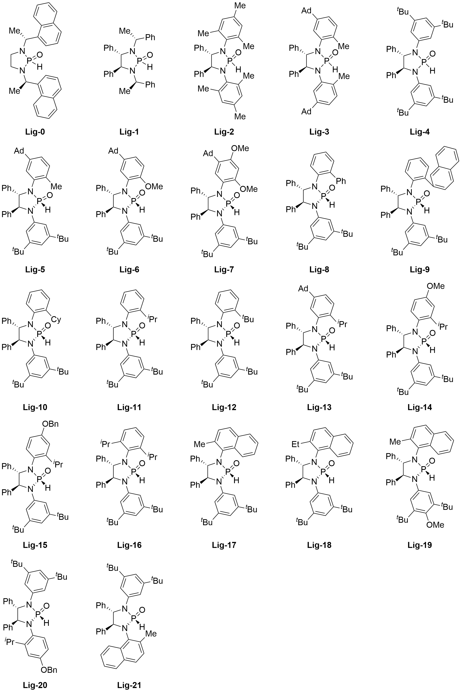

# Nickel-MLR

This is a repository for paper "*Nickel-Catalyzed Atroposelective C–H Alkylation Enabled by Bimetallic Catalysis with an Air Stable HASPO Preligand*".

# Ligand

The diamine-derived phosphine oxide ligands, used in the analysis of multivariate linear regression, are shown below.



# Demo & Instructions for use

Example.ipynb demonstrates how to perform multivariate linear regression.

# Dependence

In order to run Jupyter Notebook for machine learning application demonstration, several third-party python packages are required.

```
python>=3.9.16
numpy>=1.23.5
pandas>=2.0.1
matplotlib>=3.3.2
scikit-learn>=1.2.2
```

# How to cite

The paper is under review.

# Contact with us

Email: hxchem@zju.edu.cn; shuangyu@zju.edu.cn
